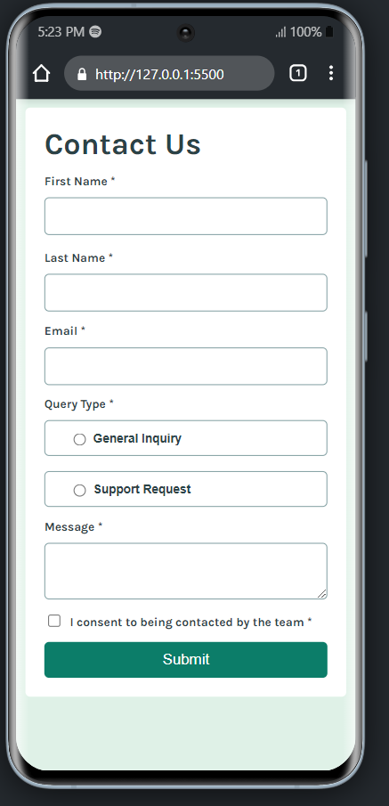
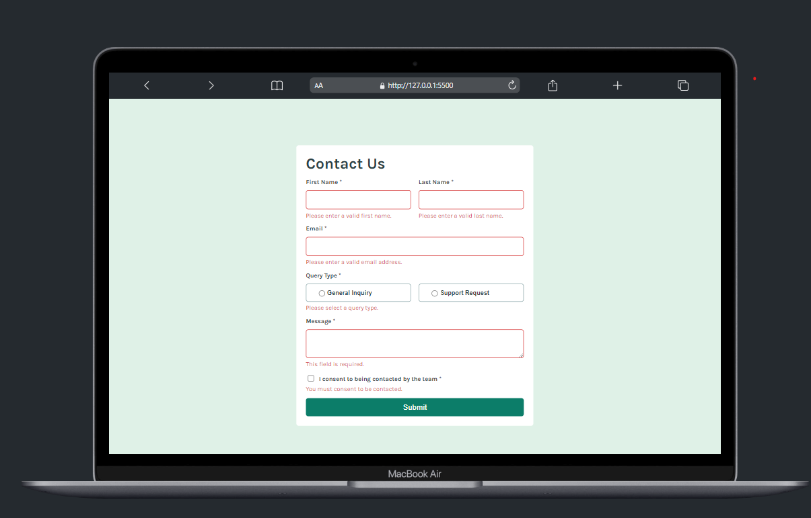
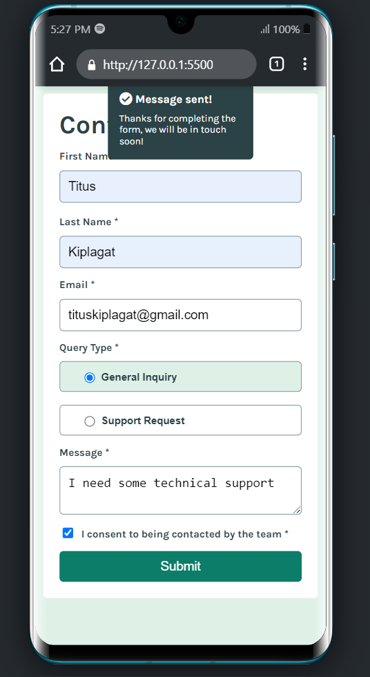

# Contact Form

## Project Overview

The **Contact Form** is a user-friendly, accessible, and responsive web form designed to facilitate communication between users and the website. This project aims to implement an advanced version of a contact form, incorporating dynamic error handling, screen reader support, keyboard navigation, and real-time validation. Additionally, it features a local draft save option to ensure users don’t lose their inputs due to accidental page refreshes or closures.

**Live Demo**: Check out the live solution from Netlify [here](https://contact-form-valid.netlify.app/).

## Table of Contents

- [Features](#features)
- [Installation](#installation)
- [Usage](#usage)
- [Screenshots](#screenshots)
- [Contributing](#contributing)
- [License](#license)

## Features

This implementation covers the following aspects:

1. **Accessibility Features**:
    - Screen reader announcements for error and success messages using `aria-live` regions.
    - Clear instructions and context for screen readers with `aria-labels` and `aria-describedby`.
    - Managed focus states for keyboard-only users during validation errors and form submissions.

2. **Form Validation**:
    - Client-side validation with real-time feedback for all input fields.
    - Required fields check for "Name," "Email," and "Message."
    - Real-time email validation using a regex pattern with dynamic error messages.

3. **Enhanced User Experience**:
    - Animated transitions for error message display, featuring fade-in and slide-in effects.
    - Custom success toast message on form submission, with auto-hide and manual dismiss options.

4. **Responsive Design**:
    - Responsive styling for optimal experience across devices (mobile, tablet, desktop).
    - Media queries to adjust form layout, padding, and touch target sizes.

5. **Save Draft Feature**:
    - Local storage support for saving form inputs, preventing data loss.
    - Auto-load saved data when revisiting the page.
    - “Clear Draft” button to reset the form and clear local storage.

6. **Keyboard Navigation and Focus Management**:
    - Complete form functionality using only the keyboard.
    - Focus management for invalid inputs and success messages for enhanced feedback.

## Installation

To get started with the Enhanced Contact Form, follow these steps:

1. Clone this repository to your local machine:
    ```bash
    git clone https://github.com/yourusername/Front-end-mentor.git
    ```
2. Navigate to the project directory:
    ```bash
    cd contact-form
    ```
3. Open `index.html` in your web browser.

## Usage

1. Fill in the form fields: "Name," "Email," and "Message."
2. Observe real-time validation as you type.
3. Click on the "Submit" button to send your message.
4. You will see a success toast message upon successful submission.
5. Use the "Clear Draft" button if you want to reset the form and clear saved data.

## Screenshots

Include screenshots of the form in different states (e.g., initial load, validation errors, success message) to give users a visual understanding of the form's functionality.
### Initial Form layout

### Validation Errors Layout

### Success Layout


## Contributing

Contributions are welcome! If you would like to contribute to this project, please follow these steps:

1. Fork the repository.
2. Create a new branch for your feature or fix:
    ```bash
    git checkout -b feature-name
    ```
3. Make your changes and commit them:
    ```bash
    git commit -m "Add your message"
    ```
4. Push to the branch:
    ```bash
    git push origin feature-name
    ```
5. Open a pull request describing your changes.

## License

This project is licensed under the MIT License. See the [LICENSE](LICENSE) file for details.