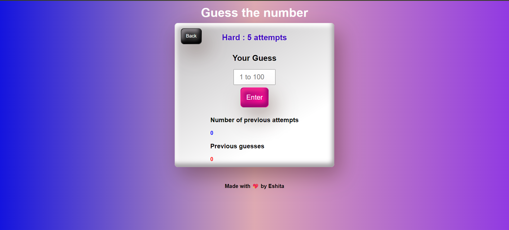
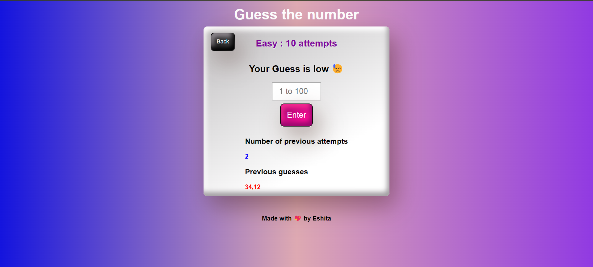
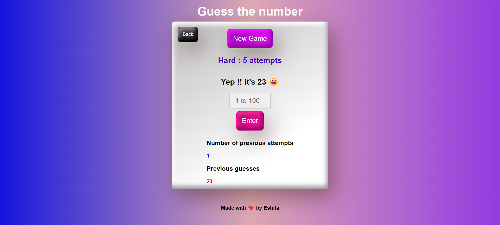

# Guess the Number Game

A simple and interactive number guessing game where players try to guess a randomly generated number between 1 and 100. The game offers two difficulty levels, with a different number of attempts to guess the correct number.

**Live Link (Fully Responsive) :** Check out the live solution from Netlify [here](https://voluble-biscuit-173585.netlify.app/)

## Table of Contents
- [Features](#features)
- [Getting Started](#getting-started)
- [Game Rules](#game-rules)
- [Technologies Used](#technologies-used)
- [File Structure](#file-structure)
- [How to Play](#how-to-play)
- [Customization](#customization)
- [Contributing](#contributing)
- [License](#license)

## Features
- **Two difficulty levels**: Easy (10 attempts) and Hard (5 attempts).
- **Real-time feedback**: Players receive hints whether their guess is too high or too low.
- **Game statistics**: Displays the number of attempts left and previous guesses.
- **Responsive design**: Works well on both mobile and desktop devices.
- **Simple user interface**: Easy to use and understand for all age groups.

### Prerequisites
To run this game, all you need is a modern web browser.

### Installation
1. Clone the repository or download the ZIP file.
   ```bash
   git clone https://github.com/yourusername/guess-the-number-game.git
   ```
2. Navigate to the project directory and open the `index.html` file in your browser.

## Game Rules
1. Choose a difficulty level: Easy or Hard.
   - **Easy Mode**: You have 10 attempts to guess the number.
   - **Hard Mode**: You have 5 attempts to guess the number.
2. The computer randomly selects a number between 1 and 100.
3. Enter your guess in the input box and click "Enter".
4. The game will inform you if your guess is high,  low, or correct.
5. The game ends when you guess the correct number or run out of attempts.

## Technologies Used
- **HTML**: Structure of the web page.
- **CSS**: Styling for the game interface.
- **JavaScript**: Game logic and interactivity.

## File Structure
```
Guess-the-Number-Game/
├── index.html      # Main HTML file for the game
├── style.css       # Stylesheet for styling the game
├── index.js        # JavaScript file for game logic
└── img/            # Images used in the game
    └── game.png    # Game-related image (illustrative)
```

## How to Play
1. Open the `index.html` file in your web browser.
2. Select the game difficulty (Easy or Hard).
3. Guess the number by entering a value between 1 and 100.
4. Follow the hints to adjust your next guess.
5. Win by guessing the correct number within the allowed number of attempts.

## Screenshots

Include screenshots of different states (e.g., game home page, game interface, correct input and game over message) to give users a visual understanding of the game's functionality.
### Game Homepage

### Game Interface (Hard & Easy)


### High Input

### Low Input

### Correct Input Message (Winning the game) and Interface

### Game Over Message (Losing the game) and Interface 


## Contributing

Contributions are welcome! If you would like to contribute to this project, please follow these steps:

1. Fork the repository.
2. Create a new branch for your feature or fix:
    ```bash
    git checkout -b feature-name
    ```
3. Make your changes and commit them:
    ```bash
    git commit -m "Add your message"
    ```
4. Push to the branch:
    ```bash
    git push origin feature-name
    ```
5. Open a pull request describing your changes.

## License

This project is licensed under the MIT License. See the [LICENSE](LICENSE) file for details.

